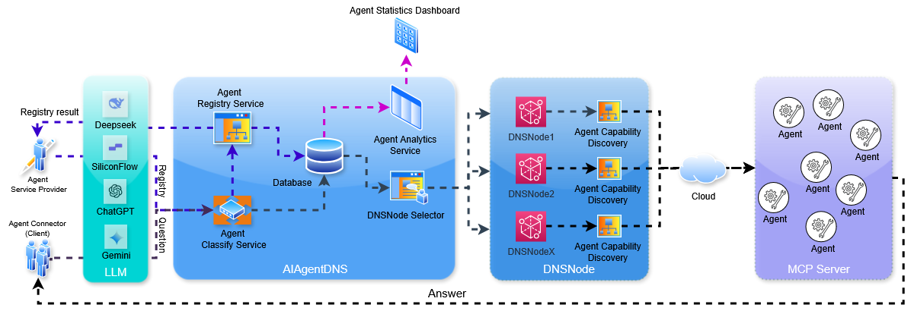

# Smart Agent Network
English | [中文版](README.zh.md)

<p align='center'>

</p>

<h1 align="center">Smart Agent Network</h1>

<p>This is a complete smart agent ecosystem. Based on the dynamic routing and collaboration mechanism of AgentDNS + DNSNode + MCP Client, it enables cross-platform and cross-model interconnection and collaboration of smart agents.</p>

## 📑 Table of Contents

- [📑 Table of Contents](#-table-of-contents)
- [🚀 Project Overview](#-project-overview)
- [🏗️ System Architecture](#-system-architecture)
- [🔍 Core Mechanisms](#-core-mechanisms)
  - [Task Semantic Parsing](#task-semantic-parsing)
  - [Dynamic Task Routing](#dynamic-task-routing)
  - [Agent Discovery and Invocation](#agent-discovery-and-invocation)
  - [Task Collaborative Execution](#task-collaborative-execution)
  - [Feedback and Optimization](#feedback-and-optimization)
  - [Fallback Mechanism](#fallback-mechanism)
- [💻 Project Components](#-project-components)
  - [AgentConnector](#agentconnector)
  - [AgentDNS](#agentdns)
  - [DNSNode](#dnsnode)
- [🔥 Core Features](#-core-features)
- [🔧 Application Scenarios](#-application-scenarios)
- [📦 Quick Start](#-quick-start)
  - [AgentConnector Installation and Usage](#agentconnector-installation-and-usage)
  - [DNSNode Registration](#dnsnode-registration)
  - [Agent Registration](#agent-registration)
- [👥 Development and Contribution](#-development-and-contribution)
- [📃 License](#-license)

## 🚀 Project Overview

This is an innovative smart agent interconnection ecosystem. It aims to solve the current isolation issue of AI agents and enable interconnection and collaboration between agents. Through the three-tier architecture of AgentDNS + DNSNode + MCP Client, a complete dynamic routing and collaboration mechanism for smart agents is built. This allows users to access and invoke various smart agent services through a unified interface.

The system breaks down barriers between different platforms, models, and smart agents. It realizes true collaborative work of smart agents and provides users with a more comprehensive and intelligent service experience.

---

## 🏗️ System Architecture

<p align='center'>

</p>

The system adopts a three-tier architecture design. Each component works collaboratively to form a complete smart agent interconnection ecosystem:

- **AgentConnector**: Serves as the user interaction interface and MCP Client. It is responsible for task input, semantic parsing, result display, and communication with AgentDNS.
- **AgentDNS**: Acts as the smart agent directory service. It maintains agent classification and service registration information, and provides agent discovery and routing functions.
- **DNSNode**: Functions as the smart agent service node. It hosts specific smart agent services, provides various tools and capabilities, and registers with AgentDNS.

---

## 🔍 Core Mechanisms

The system implements a complete set of dynamic routing and collaboration mechanisms for smart agents. The overall process includes six key steps:

### Task Semantic Parsing
1. Users input natural language task requests through AgentConnector (MCP Client).
2. The semantic parsing module preprocesses the input, including language recognition, word segmentation, intent extraction, and entity recognition.
3. The parsed results form a standardized task representation, which includes task category labels, target parameters, and execution constraints.
4. This representation serves as the input for subsequent routing and discovery.

### Dynamic Task Routing
1. Match the task representation with preset classification rules and Categories provided by AgentDNS.
2. If the task intent matches the semantic label of a certain type of agent, determine its corresponding category.
3. If multiple candidate categories are matched, a sorting algorithm based on semantic similarity is used to prioritize the optimal routing path.
4. If no match is found, mark it as "unknown" and enter the fallback process.

### Agent Discovery and Invocation
1. After the routing result is determined, AgentConnector queries AgentDNS for the DNSNode service entry under the corresponding category.
2. Based on the agent registration information returned by DNSNode, obtain the list of tools (get_available_tools) provided by the target agent.
3. Use semantic parsing results and large model reasoning capabilities to automatically generate tool invocation parameters.
4. Initiate a remote call through the execution interface (execute_tool) to obtain preliminary execution results.

### Task Collaborative Execution
1. For complex tasks, AgentConnector decomposes them into several subtasks according to semantic hierarchy.
2. Subtasks are assigned to multiple agents based on routing results, and executed in parallel or sequential collaboration mode.
3. The collaborative execution module aggregates multiple subtask results, resolves conflicts, and generates a unified output.
4. In cross-domain collaboration scenarios, it supports call chain tracking and result traceability.

### Feedback and Optimization
1. Return the execution results to AgentConnector for verification and feedback by users or the system.
2. Based on feedback information, optimize task semantic parsing and routing rules, and update the classification labels of AgentDNS.
3. The system automatically accumulates task-service invocation logs to form a self-evolving routing strategy library.
4. Through iterative optimization, improve the accuracy and efficiency of subsequent task execution.

### Fallback Mechanism
1. If the task fails to match any agent category, call the large model to directly generate an answer.
2. If part of the task matches successfully and part fails, adopt a hybrid output strategy: the matched part is executed by the agent, and the unmatched part is answered by the large model.
3. Ensure that tasks are not lost due to matching failures and improve system robustness.

---

## 💻 Project Components

### AgentConnector

AgentConnector is a feature-rich open-source AI agent client. As the user interaction interface and MCP Client of the ecosystem, it supports multiple cloud-based and local large language models, and provides powerful search enhancement and tool invocation capabilities.

**Key Features**:
- Multi-model support: Compatible with API formats of various models such as OpenAI, Gemini, and Anthropic.
- Local model integration: Supports deployment and management of local models like Ollama.
- Rich chat functions: Markdown rendering, multi-window and multi-tab architecture, Artifacts rendering, etc.
- Powerful search extension: Integrates multiple search engines and supports intelligent decision-making on when to search.
- Excellent MCP support: Fully supports the three core capabilities of Resources/Prompts/Tools.
- Cross-platform compatibility: Supports Windows, macOS, and Linux.

### AgentDNS

As the smart agent directory service, AgentDNS is a core component of the ecosystem. It is responsible for maintaining the agent classification system and service registration information, and providing agent discovery and routing functions.

**Key Functions**:
- Agent classification management: Maintains the Categories classification system and supports multi-level classification.
- Service registration and discovery: Provides DNSNode service registration interface and maintains service registration table.
- Intelligent routing: Provides the optimal routing path based on task semantics and classification rules.
- Load balancing: Supports load balancing and failover for multi-instance services.
- Security authentication: Provides authentication and authorization mechanisms for service access.

### DNSNode

As the smart agent service node, DNSNode is the component that actually hosts agent capabilities. It is responsible for registering services with AgentDNS and providing various tools and capabilities.

**Key Responsibilities**:
- Service registration: Registers the services and tools it provides with AgentDNS.
- Tool execution: Executes specific tool invocations according to requests from AgentConnector.
- Capability encapsulation: Encapsulates various AI capabilities into standard interfaces.
- Result processing: Processes execution results and returns them to AgentConnector.
- Performance monitoring: Monitors service running status and performance indicators.

---

## 🔥 Core Features

### Dynamic Agent Discovery and Routing
Realize automatic discovery and dynamic routing of agents through AgentDNS. Users do not need manual configuration, and the system automatically finds the most suitable agent service.

### Cross-Platform and Multi-Model Support
Supports multiple platforms such as Windows, macOS, and Linux. It is compatible with API formats of various models including OpenAI, Gemini, and Anthropic, and also supports local model deployment.

### Semantic Workflow and Task Decomposition
Supports workflows based on semantic understanding. It can automatically decompose complex tasks into subtasks and assign them to multiple agents for collaborative completion.

### Powerful Tool Invocation Capabilities
Through the MCP protocol, a unified tool invocation interface is implemented. It supports various tool capabilities such as code execution, network access, and file operations.

### Search Enhancement and Knowledge Management
Integrates multiple search engines and supports intelligent decision-making on when to search. It also provides a built-in knowledge base to enhance the knowledge coverage and accuracy of AI.

### Self-Evolving Routing Strategy
Based on user feedback and usage logs, the system can automatically optimize routing strategies to improve the accuracy and efficiency of task execution.

### Highly Robust Fallback Mechanism
When agent services are unavailable or tasks cannot be matched, the system can automatically switch to fallback mode to ensure that tasks are not lost.

---

## 🔧 Application Scenarios

### Agent Registration and Discovery
- Agent developers can register their agent services to AgentDNS through DNSNode.
- Users can automatically discover and use various agent services through AgentConnector.
- Supports searching and filtering agents by multiple dimensions such as category and capability.

### Daily Smart Assistant
- Answer questions, provide suggestions, and assist with writing and creation.
- Schedule management, reminders, and email management.
- Language translation, text summarization, and content creation.

### Development Assistance
- Code generation, debugging, and technical problem solving.
- Document generation, API invocation examples, and code optimization suggestions.
- Project architecture design and technical selection suggestions.

### Learning and Education
- Concept explanation, knowledge exploration, and learning assistance.
- Exercise generation, knowledge point testing, and learning path planning.
- Language learning, skill training, and professional knowledge improvement.

### Data Analysis and Visualization
- Data interpretation, chart generation, and report writing.
- Statistical analysis, trend prediction, and anomaly detection.
- Data visualization, dashboard creation, and business insight extraction.

---

## 📦 Quick Start

### AgentConnector Installation and Usage

1. Download the latest version suitable for your system from the [GitHub Releases](https://github.com/jsjfai/releases) page:
   - Windows: `.exe` installation file
   - macOS: `.dmg` installation file
   - Linux: Installation package for the corresponding distribution

2. After installation is complete, launch the AgentConnector application.

3. Configure the model:
   - Click the settings icon
   - Select the "Model Provider" tab
   - Add your API key or configure the local Ollama

4. Start using:
   - Click the "+" button to create a new conversation
   - Select the model you want to use
   - Enter your question or task

### DNSNode Registration

1. Clone the AgentDNS-Node repository
   ```bash
   git clone https://github.com/jsjfai/AgentDNS-Node.git
   cd AgentDNS-Node
   ```

2. Start the service and contact the project manager to register with AgentDNS.
   ```bash
   npm start
   # Or use pnpm
   pnpm start
   ```

### Agent Registration

1. Register the agent to DNSNode via the command line ($TOKEN needs to be obtained from the DNSNode provider)
```
curl -X POST $SERVER_URL \
  -H "x-auth-token: $TOKEN" \
  -H "Content-Type: application/json" \
  -d '{
    "name": "my-new-agent",
    "config": {
      "type": "stdio",
      "command": "npx",
      "args": [
        "-y",
        "@amap/amap-maps-mcp-server"
      ],
      "env": {
        "AMAP_MAPS_API_KEY": "a1f041b3f508081a09a53d730319a275"
      },
      "enabled": true
    }
  }'
```

2. Delete the agent from DNSNode via the command line ($TOKEN needs to be obtained from the DNSNode provider)
```
curl -X DELETE $SERVER_URL/my-new-agent \
  -H "x-auth-token: $TOKEN"
```

---

## 🚀 Our Goals
- **Establish Inter-Agent Protocols** — Build a unified interoperability standard for intelligent agents.
- **Advance Task-Oriented AI Collaboration** — Promote an open, task-driven multi-agent collaboration ecosystem.
- **Build a Verifiable AI Service Network** — Develop a trustworthy and auditable AI service infrastructure that ensures transparency, reliability, and accountability.

---

## 👥 Development and Contribution
We welcome contributions to the Agent Network project, whether it is code submission, document writing, or issue feedback.

---

## 📃 License
The Agent Network project adopts the Apache License 2.0 open-source license.