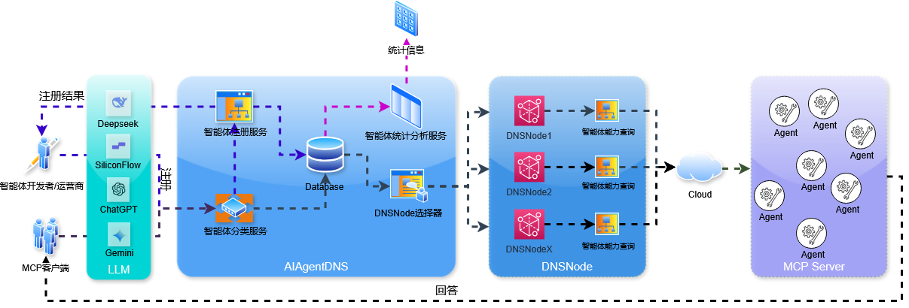
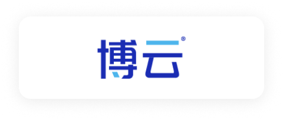
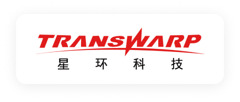

<p align='center'>

</p>

<h1 align="center">智能体网络</h1>

<p>这是一个完整的智能体生态系统，基于AgentDNS + DNSNode + MCP客户端的智能体动态路由与协作机制，实现跨平台、跨模型的智能体互联互通。</p>

## 📑 目录

- [📑 目录](#-目录)
- [🚀 项目概述](#-项目概述)
- [🏗️ 系统架构](#-系统架构)
- [🔍 核心机制](#-核心机制)
  - [任务语义解析](#任务语义解析)
  - [动态任务路由](#动态任务路由)
  - [智能体发现与调用](#智能体发现与调用)
  - [任务协作执行](#任务协作执行)
  - [反馈与优化](#反馈与优化)
  - [兜底机制](#兜底机制)
- [💻 项目组件](#-项目组件)
  - [AgentConnector](#agentconnector)
  - [AgentDNS](#agentdns)
  - [DNSNode](#dnsnode)
- [🔥 核心功能](#-核心功能)
- [🔧 应用场景](#-应用场景)
- [📦 快速开始](#-快速开始)
  - [AgentConnector 安装与使用](#agentconnector-安装与使用)
  - [DNSNode 注册](#dnsnode-注册)
  - [Agent 注册](#agent-注册)
- [👥 开发与贡献](#-开发与贡献)
- [📃 许可证](#-许可证)

## 🚀 项目概述

这是一个创新的智能体互联生态系统，旨在解决当前AI智能体孤岛问题，实现智能体之间的互联互通与协作。通过AgentDNS + DNSNode + MCP客户端的三层架构，构建了一套完整的智能体动态路由与协作机制，使得用户可以通过统一的界面访问和调用各种智能体服务。

该系统打破了不同平台、不同模型、不同智能体之间的壁垒，实现了真正的智能体协同工作，为用户提供更全面、更智能的服务体验。

## 🏗️ 系统架构

<p align='center'>

</p>

系统采用三层架构设计，各组件协同工作，形成完整的智能体互联生态：

- **AgentConnector**：作为用户交互界面和MCP客户端，负责任务输入、语义解析、结果展示，以及与AgentDNS的通信。
- **AgentDNS**：作为智能体目录服务，维护智能体分类和服务注册信息，提供智能体发现和路由功能。
- **DNSNode**：作为智能体服务节点，承载具体的智能体服务，提供各种工具和能力，并向AgentDNS注册。

## 🔍 核心机制

系统实现了一套完整的智能体动态路由与协作机制，整体流程包括六个关键步骤：

### 任务语义解析
1. 用户通过AgentConnector（MCP客户端）输入自然语言任务请求；
2. 语义解析模块对输入进行预处理，包括语言识别、分词、意图提取与实体识别；
3. 解析后的结果形成标准化任务表示，包含任务类别标签、目标参数与执行约束；
4. 该表示作为后续路由与发现的输入。

### 动态任务路由
1. 将任务表示与预置分类规则及AgentDNS提供的Categories进行匹配；
2. 若任务意图与某一类智能体的语义标签相符，则确定其对应类别；
3. 若匹配到多个候选类别，采用基于语义相似度的排序算法，优先选择最优路由路径；
4. 若未能匹配，则标记为unknown，进入兜底流程。

### 智能体发现与调用
1. 路由结果确定后，AgentConnector向AgentDNS查询对应类别下的DNSNode服务入口；
2. 基于DNSNode返回的智能体注册信息，获取目标智能体可提供的工具列表（get_available_tools）；
3. 使用语义解析结果和大模型推理能力，自动生成工具调用参数；
4. 通过执行接口（execute_tool）发起远程调用，获得初步执行结果。

### 任务协作执行
1. 对于复杂任务，AgentConnector根据语义层次将其分解为若干子任务；
2. 子任务根据路由结果分派至多个智能体，采用并行或顺序协作模式执行；
3. 协作执行模块对多个子任务结果进行聚合、冲突消解与统一输出；
4. 在跨域协作场景下，支持调用链追踪与结果可溯源。

### 反馈与优化
1. 将执行结果返回至AgentConnector，由用户或系统进行验证与反馈；
2. 基于反馈信息，优化任务语义解析与路由规则，更新AgentDNS的分类标签；
3. 系统自动积累任务-服务的调用日志，形成可自进化的路由策略库；
4. 通过迭代优化，提升后续任务执行的准确性与效率。

### 兜底机制
1. 当任务未能匹配任何智能体类别，则调用大模型直接生成回答；
2. 当部分任务匹配成功、部分匹配失败时，采用混合输出策略：已匹配部分交由智能体执行，未匹配部分由大模型回答；
3. 确保任务不因匹配失败而丢失，提升系统鲁棒性。

## 💻 项目组件

### AgentConnector

AgentConnector是一个功能丰富的开源AI智能体客户端，作为生态系统的用户交互界面和MCP客户端，支持多种云端和本地大语言模型，并提供强大的搜索增强和工具调用能力。

**主要特性**：
- 多模型支持：兼容OpenAI、Gemini、Anthropic等多种模型API格式
- 本地模型集成：支持Ollama等本地模型部署和管理
- 丰富的聊天功能：Markdown渲染、多窗口多Tab架构、Artifacts渲染等
- 强大的搜索扩展：集成多种搜索引擎，支持智能决定何时搜索
- 优秀的MCP支持：完整支持Resources/Prompts/Tools三大核心能力
- 跨平台兼容：支持Windows、macOS、Linux

### AgentDNS

AgentDNS作为智能体目录服务，是生态系统的核心组件，负责维护智能体分类体系和服务注册信息，提供智能体发现和路由功能。

**主要功能**：
- 智能体分类管理：维护Categories分类体系，支持多级分类
- 服务注册发现：提供DNSNode服务注册接口，维护服务注册表
- 智能路由：根据任务语义和分类规则，提供最优路由路径
- 负载均衡：支持多实例服务的负载均衡和故障转移
- 安全认证：提供服务访问的认证和授权机制

### DNSNode

DNSNode作为智能体服务节点，是实际承载智能体能力的组件，负责向AgentDNS注册服务，并提供各种工具和能力。

**主要职责**：
- 服务注册：向AgentDNS注册自身提供的服务和工具
- 工具执行：根据AgentConnector的请求，执行具体的工具调用
- 能力封装：将各种AI能力封装为标准接口
- 结果处理：处理执行结果并返回给AgentConnector
- 性能监控：监控服务运行状态和性能指标

## 🔥 核心功能

### 智能体动态发现与路由
通过AgentDNS实现智能体的自动发现和动态路由，用户无需手动配置，系统自动找到最适合的智能体服务。

### 跨平台多模型支持
支持Windows、macOS、Linux等多种平台，兼容OpenAI、Gemini、Anthropic等多种模型API格式，同时支持本地模型部署。

### 语义工作流与任务分解
支持基于语义理解的工作流，能够将复杂任务自动分解为子任务，并分配给多个智能体协作完成。

### 强大的工具调用能力
通过MCP协议，实现统一的工具调用接口，支持代码执行、网络访问、文件操作等多种工具能力。

### 搜索增强与知识管理
集成多种搜索引擎，支持智能决定何时搜索，同时提供内置知识库，增强AI的知识覆盖和准确性。

### 可自进化的路由策略
基于用户反馈和使用日志，系统能够自动优化路由策略，提升任务执行的准确性和效率。

### 高鲁棒性的兜底机制
当智能体服务不可用或任务无法匹配时，系统能够自动切换到兜底模式，确保任务不会丢失。

## 🔧 应用场景

### 智能体注册与发现
- 智能体开发者可以通过DNSNode将自己的智能体服务注册到AgentDNS
- 用户可以通过AgentConnector自动发现和使用各种智能体服务
- 支持按类别、能力等多维度搜索和筛选智能体

### 日常智能助手
- 回答问题、提供建议、辅助写作和创作
- 日程安排、提醒事项、邮件管理
- 语言翻译、文本摘要、内容创作

### 开发辅助
- 代码生成、调试、技术问题解答
- 文档生成、API调用示例、代码优化建议
- 项目架构设计、技术选型建议

### 学习与教育
- 概念解释、知识探索、学习辅导
- 练习题生成、知识点测试、学习路径规划
- 语言学习、技能培训、专业知识提升

### 数据分析与可视化
- 数据解读、图表生成、报告撰写
- 统计分析、趋势预测、异常检测
- 数据可视化、仪表盘创建、业务洞察

## 📦 快速开始

### AgentConnector 安装与使用

1. 从[GitHub Releases](https://github.com/jsjfai/releases)页面下载适合您系统的最新版本：
   - Windows: `.exe`安装文件
   - macOS: `.dmg`安装文件
   - Linux: 对应发行版的安装包

2. 安装完成后，启动AgentConnector应用

3. 配置模型：
   - 点击设置图标
   - 选择"模型提供商"选项卡
   - 添加您的API密钥或配置本地Ollama

4. 开始使用：
   - 点击"+"按钮创建新对话
   - 选择您想使用的模型
   - 输入您的问题或任务

### 注册DNSnode

1. 克隆AgentDNS-Node仓库
   ```bash
   git clone https://github.com/jsjfai/AgentDNS-Node.git
   cd AgentDNS-Node
   ```

2. 启动服务，并联系项目负责人注册到AgentDNS。
   ```bash
   npm start
   # 或使用pnpm
   pnpm start
   ```

### 注册智能体

1. 通过命令行注册智能体到DNSNode ($TOKEN需联系DNSNode提供方)
```
curl -X POST $SERVER_URL \
  -H "x-auth-token: $TOKEN" \
  -H "Content-Type: application/json" \
  -d '{
    "name": "my-new-agent",
    "config": {
      "type": "stdio",
      "command": "npx",
      "args": [
        "-y",
        "@amap/amap-maps-mcp-server"
      ],
      "env": {
        "AMAP_MAPS_API_KEY": "a1f041b3f508081a09a53d730319a275"
      },
      "enabled": true
    }
  }'
```

2. 通过命令行在DNSNode删除智能体 ($TOKEN需联系DNSNode提供方)
```
curl -X DELETE $SERVER_URL/my-new-agent \
  -H "x-auth-token: $TOKEN"
```

## 🚀 我们的目标

- 建立 **智能体互操作标准**（Inter-Agent Protocols）
- 推动 **任务驱动的多智能体协作生态**（Task-Oriented AI Network）
- 打造 **可信、可验证的 AI 服务网络**（Verifiable AI Service Network）

## 👥 开发与贡献
我们欢迎对智能体网络项目的贡献，无论是代码提交、文档编写还是问题反馈。

## 🤝 合作伙伴
<table>
  <tbody>
    <tr>
      <td align="center" valign="middle"></td>
      <td align="center" valign="middle"></td>
      <td align="center" valign="middle"></td>
      <td align="center" valign="middle"></td>
      <td align="center" valign="middle"></td>
      <td align="center" valign="middle"></td>
    </tr>
    <tr>
      <td align="center" valign="middle"></td>
      <td align="center" valign="middle"></td>
      <td align="center" valign="middle"></td>
      <td align="center" valign="middle"></td>
      <td align="center" valign="middle"></td>
      <td align="center" valign="middle"></td>
    </tr>
    <tr>
      <td align="center" valign="middle"></td>
      <td align="center" valign="middle"></td>
      <td align="center" valign="middle"></td>
      <td align="center" valign="middle"></td>
      <td align="center" valign="middle"></td>
      <td align="center" valign="middle"></td>
    </tr>
  </tbody>
</table>

## 📃 许可证
智能体网络项目采用Apache License 2.0开源许可证。
